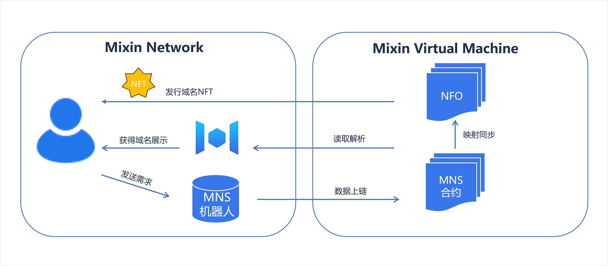

# 应用架构

MNS 服务是跨网协同的架构。智能合约部署于 MVM（Mixin Virtual Machine）网络，域名 NFT 在 Mixin Network 发行，MNS 机器人作为协同中枢。

例如，一个 标准的注册流程主要包括如下环节：

- 用户提出注册请求并完成支付
- MNS 服务确认无注册冲突后发起链上请求
- 链上确认后，MNS 服务同步结果
- NFO 铸造域名 NFT

MNS 架构示意图

参考：

[术语](term)
